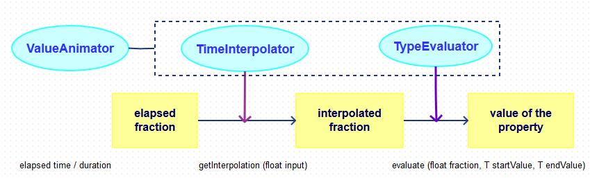

# HelloAnimations
Sample project for Android Animations.

## Property Animation
[Property Animation](https://developer.android.com/guide/topics/graphics/prop-animation.html)

Property Animation相关的类:
- [ValueAnimator](https://developer.android.com/reference/android/animation/ValueAnimator.html)
- [ObjectAnimator](https://developer.android.com/reference/android/animation/ObjectAnimator.html)
- [AnimatorSet](https://developer.android.com/reference/android/animation/AnimatorSet.html)

对应的xml中元素:
- `ValueAnimator` -> `<animator>`
- `ObjectAnimator` -> `<objectAnimator>`
- `AnimatorSet` -> `<set>`

Property Animation相关的类都处在包`android.animation`中, 除了用到的Interpolater都在`android.view.animation`包中.
Property Animation的xml文件在`res/animator`文件夹中.

### Listeners
[Animator.AnimatorListener](https://developer.android.com/reference/android/animation/Animator.AnimatorListener.html)
动画的开始, 结束, 重复, 和取消事件. (常用).

[ValueAnimator.AnimatorUpdateListener](https://developer.android.com/reference/android/animation/ValueAnimator.AnimatorUpdateListener.html)
和`ValueAnimator`配合使用, 接收每一帧的回调和计算出来的值. (因为通常只配合`ValueAnimator`, 不常用).

- `onAnimationUpdate()`动画的每一帧都调用, 可以通过`getAnimatedValue()`得到当前动画值.

根据你当前动画的对象和属性, 你可能需要自己调用`invalidate()`方法来强制View重绘.
不过所有View的set方法都已经自己做了`invalidate()`的工作, 所以在调用这些方法的时候不需要手动invalidate.

### Layout Animation
ViewGroup默认的layout动画可以在xml中通过`android:animateLayoutChanges="true"`开启.
当ViewGroup中的成员发生增加/减少, 显示/隐藏, 就会出现该动画效果.

如果需要指定自定义的layout动画, 可以通过`setLayoutTransition()`给ViewGroup指定一个`LayoutTransition`.
`LayoutTransition.setAnimator(int transitionType, Animator animator)`方法可用于指定五种具体类型的动画:
- CHANGE_APPEARING
- CHANGE_DISAPPEARING
- APPEARING
- DISAPPEARING
- CHANGING

## Interpolators
整个动画过程中, 涉及的计算分三步:
- 1.`ValueAnimator`对象根据动画的总时间和已经流逝的时间计算出一个0到1之间的elapsed fraction值.
这个elapsed fraction值就代表了时间完成的程度.
- 2.计算出elapsed fraction之后, `ValueAnimator`对象会调用`TimeInterpolator`来计算一个interpolated fraction, 即, 根据所设置的时间插值方法将elapsed fraction映射到interpolated fraction.
(如果是线性插值的话elapsed fraction和interpolated fraction会是一直相等的, 但是非线性变换就不是了).
- 3.interpolated fraction计算出来后, `ValueAnimator`会调用`TypeEvaluator`, 计算动画属性值.
这时候用的输入参数就是interpolated fraction的值, 以及属性值的起始值和终止值.

整个过程如下图所示：

所有的Interpolater都是整个接口的子类:
[Interpolator](https://developer.android.com/reference/android/view/animation/Interpolator.html)

## View Animation
[View Animation](https://developer.android.com/guide/topics/graphics/view-animation.html)
View Animation相关的类都在`android.view.animation`包中.
View Animation相关的xml文件在`res/anim`文件夹中.

- [AlphaAnimation](https://developer.android.com/reference/android/view/animation/AlphaAnimation.html)
- [RotateAnimation](https://developer.android.com/reference/android/view/animation/RotateAnimation.html)
- [ScaleAnimation](https://developer.android.com/reference/android/view/animation/ScaleAnimation.html)
- [TranslateAnimation](https://developer.android.com/reference/android/view/animation/TranslateAnimation.html)
- [AnimationSet](https://developer.android.com/reference/android/view/animation/AnimationSet.html)

对应的xml中元素:
- `AlphaAnimation` -> `<alpha>`
- `RotateAnimation` -> `<rotate>`
- `ScaleAnimation` -> `<scale>`
- `TranslateAnimation` -> `<translate>`
- `AnimationSet` -> `<set>`

View Animation有一个缺点就是当View被移动到另一个位置以后, 其真实的位置仍在原来的位置.
即: 点击当前所看到的View并不会触发点击事件, 但点击它初始的位置会触发.

## Transitions
在Android 5.0 (API 21)之前, Activity的转场动画是靠`overridePendingTransition()`指定(指定anim), Fragment是`setCustomAnimations()`指定(v4指定anim, 非v4指定animator).
它们只能把整个屏幕作为整体做转换.

从Android 5.0开始, Lollipop APIs让我们可以独立地动画场景中的View元素, 并且可以在两个Activity/Fragment转换的过程中移动共享元素.

### Shared Element Transition
注意实际进行动画的元素是第二屏的View, 所以如果shared view中的内容并不一致, 动画效果并不理想.

## Reference Demos
- [AnimationApiDemos](https://github.com/mengdd/AnimationApiDemos) (Old demo in Eclipse time).
- [Material-Animations](https://github.com/lgvalle/Material-Animations)

## References
- [官方文档Training Adding Animations](https://developer.android.com/training/animation/index.html)
- [官方文档Training Defining Custom Animations](https://developer.android.com/training/material/animations.html)
- [官方文档Guides Animation and Graphics Overview](https://developer.android.com/guide/topics/graphics/overview.html)
- [CodePath Animations](https://guides.codepath.com/android/Animations)

Transitions:
- [官方文档Training Transitions](https://developer.android.com/training/transitions/overview.html)
- [Activity & Fragment Transitions](http://www.androiddesignpatterns.com/2014/12/activity-fragment-transitions-in-android-lollipop-part1.html)

早年的博客系列文章:
[Android Animation](http://www.cnblogs.com/mengdd/category/514665.html)
